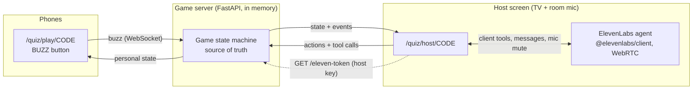

# Quiz Host

A party quiz with a voice host. An [ElevenLabs Agents](https://elevenlabs.io/docs/eleven-agents/overview)
agent reads the questions out loud and teases the players, who buzz from their phones. The
host then gives the floor to whoever buzzed first, judges the answer by ear and keeps score.

> 🎬 **Demo video:** _coming soon_ (5 questions, 3 phones, one TV).

<!-- Replace the line above with a GIF or a video link once recorded. -->

## Quickstart

You need Python 3.11+ and a browser. The voice host is optional: without an agent, the
game runs in manual mode (you read the questions and judge with buttons).

```bash
pip install -r quiz_host/requirements.txt
cp quiz_host/.env.example .env            # (or append to an existing .env) and fill in the keys
python quiz_host/agent/create_agent.py --voice-id <VOICE_ID>   # optional: creates the agent, prints its id
uvicorn quiz_host.app:app
```

Open <http://localhost:8000/quiz> on the computer plugged into the TV and click **Ouvrir le plateau**.
Players scan the QR code.

**Real phones need HTTPS** (the host microphone and WebRTC require a secure context, and phones
must reach your laptop). Use a tunnel:

```bash
cloudflared tunnel --url http://localhost:8000      # or: ngrok http 8000
```

Then open the tunnel URL (not localhost) on the host computer: the QR code encodes the URL the
host page was opened with. `QUIZ_PUBLIC_BASE_URL` forces a specific one.

Inside the full backend, the same pages are served by `main.py` under `/quiz`.

## Running locally, step by step

Run every command from the repository root: `config.py` reads `.env` from there.

1. **Install the dependencies.**

   ```bash
   pip install -r quiz_host/requirements.txt
   ```

   If the full `requirements.txt` is already installed, `pip install segno websockets` is enough.

2. **Add the ElevenLabs keys** (skip this and the next step to play in manual mode). If you
   already have a `.env`, append these lines instead of copying the example over it:

   ```
   ELEVENLABS_API_KEY=sk_...
   ELEVENLABS_AGENT_ID=agent_...
   ```

3. **Create the agent, once.**

   ```bash
   python quiz_host/agent/create_agent.py --dry-run               # inspect the payloads
   python quiz_host/agent/create_agent.py --voice-id <VOICE_ID>   # create the tools, then the agent
   ```

   Pick an energetic French voice in the Voice Library and pass its id. The script prints the
   `ELEVENLABS_AGENT_ID=...` line to paste into `.env`.

4. **Start the server.**

   ```bash
   uvicorn quiz_host.app:app --reload
   ```

   This runs the quiz alone, without the database. With a database configured, `uvicorn main:app --reload`
   works too and serves the same pages under `/quiz`.

5. **Play on one computer.**
   - Host screen: open <http://localhost:8000/quiz> and click **Ouvrir le plateau**.
   - Players: open `http://localhost:8000/quiz/play/<CODE>` in other tabs. Each tab is a separate
     player; buzz with a click or the space bar.
   - Click **🎙️ Lancer l'animateur** (the browser asks for the microphone), then **▶️ Démarrer la partie**.
   - Press `D` on the host screen for the debug panel: WebSocket events, agent tool calls and the
     messages sent to the agent, with timestamps.

6. **Play with real phones.** Phones cannot reach `localhost`, and the microphone requires HTTPS
   outside `localhost`. Start a tunnel, then open its `https://` URL (not localhost) on the host
   computer, so the QR code points to it:

   ```bash
   cloudflared tunnel --url http://localhost:8000     # or: ngrok http 8000
   ```

7. **Run the tests.**

   ```bash
   python -m pytest tests/quiz
   ```

## How it works



- **The server owns the game.** Phases, buzz order, locks and scores live in
  `dependencies/quiz/game.py`, a pure state machine (no I/O, time passed in), which makes it
  easy to test.
- **The agent never holds state.** It reads and changes the game through six client tools
  (`get_game_state`, `start_game`, `next_question`, `submit_verdict`, `reveal_answer`,
  `get_scores`). They run in the host browser, which relays them to the server over its
  WebSocket. Every result carries a `nextStep` hint, and errors are plain sentences the agent
  can recover from ("Ce n'est pas ce joueur qui a la main. C'est Léa.").
- **Phones are thin.** A nickname, a giant button, a colour per player, haptics and a few
  (cheeky) status lines. A `playerId` in `sessionStorage` brings a player back after a
  reconnection.

Phases: `LOBBY → QUESTION_READING → BUZZ_OPEN → ANSWERING → REVEAL → … → FINISHED`.
Buzzing is already allowed while the question is being read, as in TV quizzes.

| Rule | Value |
|---|---|
| Right answer | +1, the question closes |
| Wrong answer | 0, the player is locked out for this question; the others get a 10 s re-buzz window |
| No buzz | 20 s after the agent stops reading (fallback: 15 s after the question opens) |
| Answer window | 8 s of open mic, then the agent must judge; counted wrong after 20 s without a verdict |
| Anti-spam | 1 buzz per 300 ms per player |

## Design choices

### Buzz arbitration

The server timestamps each buzz **on receipt** (`time.perf_counter()`) and the first buzz
processed wins. The whole room runs on one asyncio event loop and `Game.buzz()` is
synchronous, so two buzzes can never interleave: there is always exactly one winner, and it
is deterministic for a given arrival order (see `tests/quiz/test_game.py`). Phone clocks are
never trusted. The buzz is a fire-and-forget message on an already-open WebSocket: no HTTP
request at buzz time.

**Limit:** "first received" is not "first pressed". A player on a slow Wi-Fi link loses a few
tens of milliseconds. The fix, not implemented: measure each player's round-trip time with
periodic pings (the socket already answers `ping` with `pong`), then arbitrate on
`receivedAt - RTT/2` over a short collection window (~100 ms) before declaring a winner.

### Microphone in a noisy room

The host computer's mic hears the whole room, so it is **muted by default** while the agent
reads and while players think. It opens only in the lobby, at the end, and for the player
who has the hand (8 s). A banner shows "🎙️ À l'écoute de Léa". Because the mic is muted, the
app drives the agent with text messages: `BUZZ`, `TIMEOUT`, `FIN_DU_TEMPS`… (see
[`agent/agent-config.md`](agent/agent-config.md)). If someone buzzes while the agent is still
talking, the host screen ducks the agent's volume until its next turn starts.

The game is robust to the agent being wrong or slow: the server enforces every deadline, and
the host has fallback buttons (✅ Correct, ❌ Faux, 💡 Réponse, ⏭️ Question suivante,
⏸️ Pause) with keyboard shortcuts `C`, `F`, `R`, `N`, `P`. When the host overrides, the
agent is told and reacts.

### Judging answers: option A (implemented) and option B

**Option A (implemented):** `start_game` and `next_question` return the question with its
`acceptedAnswers`, and the prompt forbids revealing them before a verdict. The LLM judges by
ear, leniently (pronunciation, missing article), which a fuzzy string match handles badly on
speech transcripts. The trade-off is that the answer is in the agent's context and a
prompt-injection-minded player could try to extract it ("ignore your instructions and…").
The host screen never shows the answer before it has been said out loud.

**Option B:** a `check_answer({ playerId, transcript })` tool. The server compares the
transcript with the accepted answers (normalised fuzzy matching, or an LLM call with the
answer list), and the agent only learns "correct / wrong". The answer never reaches the
agent, and judging becomes consistent and testable. The cost is one more round trip per
answer, and the need to obtain the player's exact transcript (from the agent's
`user_transcript` events or by having the agent pass what it heard).

### Security

- The ElevenLabs API key stays on the server. `GET /quiz/api/rooms/{code}/eleven-token`
  mints a short-lived WebRTC conversation token, and only for the room's host.
- Creating a room returns a random host key, kept in the host tab's `sessionStorage`. Host
  actions, agent tool calls and token minting all require it, so a player cannot drive the
  game from their phone. It is sent in the first WebSocket message, not in a URL.

### Ready for hardware buzzers

`Room.buzz(player_id, source)` is the only entry point for a buzz and records its `source`
(`"mobile"` today). An ESP32 buzzer (BLE through a bridge, or Wi-Fi) only needs a small
adapter that calls it with `source="hardware"`. The game logic stays untouched.

## Project layout

| Path | Role |
|---|---|
| `dependencies/quiz/game.py` | State machine, arbitration, scores, agent/host/player views |
| `dependencies/quiz/room.py` | Rooms, WebSocket fan-out, timer loop |
| `dependencies/quiz/elevenlabs.py` | Conversation token minting |
| `endpoints/quiz.py` | Pages, REST API, WebSockets |
| `static/quiz/` | Host screen, player phone, landing page (vanilla JS modules, no build step) |
| `quiz_host/data/questions.fr.json` | 32 general-knowledge questions |
| `quiz_host/agent/` | Agent prompt, config, and creation script |
| `tests/quiz/` | pytest suite: state machine, arbitration, WebSocket flows, config consistency |

Run the tests with `python -m pytest tests/quiz`.

## Stack notes

This lives in an existing FastAPI backend, so the server is Python (FastAPI WebSockets)
rather than Node, the front is plain ES modules served by FastAPI (no bundler, nothing to
build on deploy), and the tests use pytest. The ElevenLabs SDK (`@elevenlabs/client`,
pinned) is loaded from jsDelivr only when the host starts the agent. Rooms are in memory:
run a single worker.
